<div align="center">

<!-- ═══════════════════ HEADER ═══════════════════ -->



<!-- ═══════════════════ TYPING SVG ═══════════════════ -->


<br>


&nbsp;

&nbsp;


</div>


## &nbsp; ⚡ About

Final-year B.Tech IT student building AI systems that work — from RAG pipelines and LLM evaluation to full-stack applications. Passionate about Generative AI, clean code, and turning research into shipped products. Always learning, always building.


## &nbsp; 🛠️ Tech Stack

<div align="center">

| **AI / ML / RAG** | **Web Development** | **Tools & Platforms** |
|:---:|:---:|:---:|
|              |          |    _|

</div>


## &nbsp; 💭 Beyond Code
```
✦ Curious by nature — I learn best by asking why, not just how
✦ Design-conscious — clean UI, clean code, clean thinking
✦ Turning research concepts into working prototypes
✦ Most of my best ideas come from deep thinking, not scrolling
```


## &nbsp; 🔗 Connect

<div align="center">

<a href="https://github.com/sonidev-creations"></a>
&nbsp;&nbsp;
<a href="https://www.linkedin.com/in/sonipandian/"></a>
&nbsp;&nbsp;
<a href="mailto:iamsoni.btech@gmail.com"></a>

<br><br>


</div>


